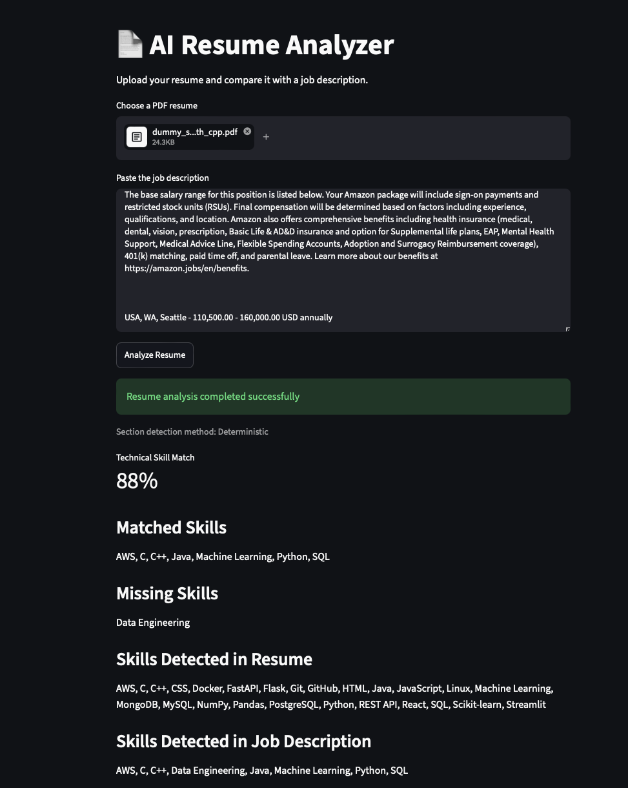
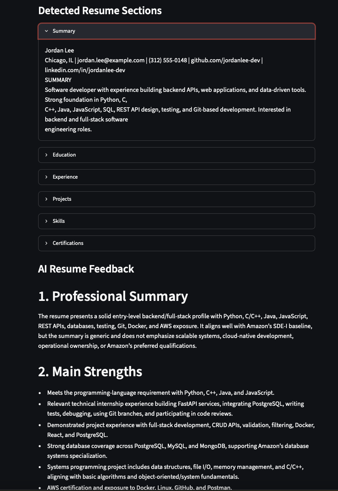
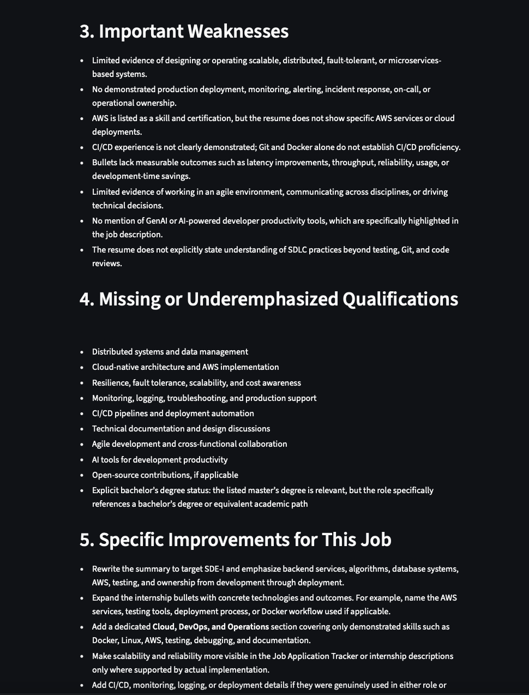
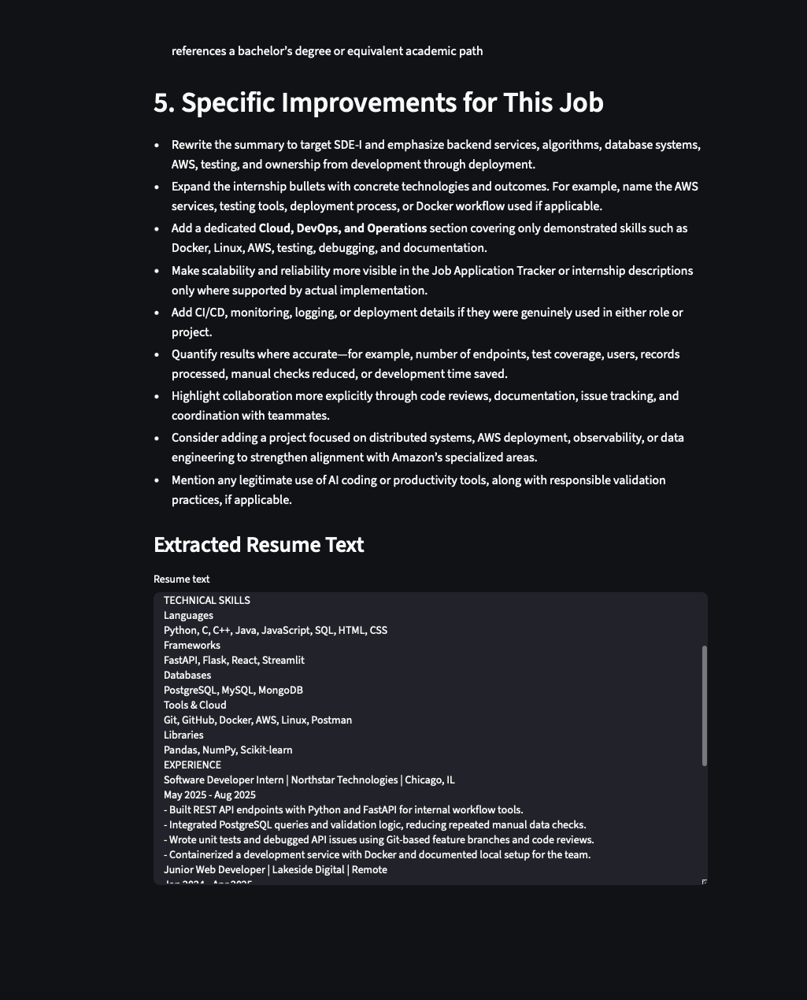

# AI Resume Analyzer

A full-stack resume analysis application built with FastAPI and Streamlit that compares a PDF resume against a job description.

The application combines deterministic text analysis with AI-powered feedback to identify technical skill matches, analyze resume structure, and provide actionable feedback for improving alignment with a job description. 

## Features

- Upload and parse PDF resumes
- Extract text from PDF files using PyMuPDF
- Detect technical skills using regular expressions
- Extract relevant skills from a job description
- Calculate a technical skill match score
- Identify matched and missing skills
- Detect common resume sections such as Education, Experience, Projects, and Skills
-Use AI powered skill extraction if deterministic extraction is not possible
- Generate AI-powered resume feedback using the OpenAI API
- Display analysis results through an interactive Streamlit interface

## Demo
Screenshots:
### 1. Screenshot 1


### 2. Screenshot 2


### 3. Screenshot 3


### 4. Screenshot 4


## Tech Stack

### Backend

- Python
- FastAPI
- PyMuPDF
- Regular Expressions
- OpenAI API

### Frontend

- Streamlit
- Requests

### Development Tools

- Git
- GitHub
- VS Code

## How It Works

1. The user uploads a PDF resume and pastes a job description into the Streamlit interface.
2. Streamlit sends the resume and job description to the FastAPI backend using a multipart HTTP request.
3. PyMuPDF extracts plain text from the uploaded resume.
4. The application detects technical skills in both the resume and job description.
5. The detected skills are compared to determine matched and missing skills.
6. A technical skill match percentage is calculated.
7. The application analyzes the structure and sections of the resume.
8. The OpenAI API provides additional AI-powered resume analysis and feedback.
9. FastAPI returns the results to Streamlit for display.

## Architecture

```text
User
 │
 ▼
Streamlit Frontend
 │
 │ HTTP POST
 │ Resume + Job Description
 ▼
FastAPI Backend
 │
 ├── PDF Text Extraction
 │
 ├── Skill Detection
 │
 ├── Skill Match Scoring
 │
 ├── Resume Section Detection
 │
 └── AI Resume Analysis
 │
 ▼
JSON Response
 │
 ▼
Streamlit Results
```


## Project Structure
```text
ai-resume-analyzer/
├── app/
│   ├── __init__.py
│   ├── ai_analyzer.py
│   ├── ai_sections.py
│   ├── main.py
│   ├── parser.py
│   ├── scorer.py
│   ├── sections.py
│   └── skills.py
├── frontend/
│   └── streamlit_app.py
├── .gitignore
├── hello.py
├── LICENSE
├── README.md
└── requirements.txt
```


## Installation

### 1. Clone the repository

git clone https://github.com/Abhejay44/ai-resume-analyzer.git
cd ai-resume-analyzer

### 2. Create a virtual environment


python -m venv .venv


Activate it on macOS/Linux:

source .venv/bin/activate


On Windows:

.venv\Scripts\activate


### 3. Install dependencies


pip install -r requirements.txt


## Environment Variables

Create a `.env` file in the root directory:


OPENAI_API_KEY= your_personal_openai_api_key


## Running the Application

The application requires the FastAPI backend and Streamlit frontend to run at the same time.

### Start the FastAPI backend

From the project root:

python -m uvicorn app.main:app --reload


### Start the Streamlit frontend

Open a second terminal, activate the virtual environment, and run:

python -m streamlit run frontend/streamlit_app.py

## API

### Analyze Resume

The endpoint accepts:

- `resume` - PDF resume file
- `job_description` - Job description text

The backend processes the resume and returns analysis results including:

- Extracted resume text
- Resume skills
- Job-description skills
- Matched skills
- Missing skills
- Technical skill match score
- Detected resume sections
- AI-generated feedback

## Scoring

The technical skill match score is calculated by comparing the recognized technical skills required by the job description against the skills detected in the resume.

Skill Match % = Matched Job Skills / Detected Job Skills × 100

This score is designed to provide a transparent technical-skill comparison that provides a rough idea about your skill compatibility with the job but it is not comparable to any specific commercial Applicant Tracking System (ATS).

## Error Handling

The application includes handling for common errors such as:

- Invalid or unsupported files
- PDFs without any readable text
- Missing job descriptions
- Backend connection failures
- OpenAI API quota errors

The deterministic resume analysis can continue even when AI analysis is unavailable.

## Future Improvements

Potential future improvements include:

- Full ATS score
- Semantic skill matching
- Structured AI responses
- More advanced resume scoring
- Additional document formats
- Application deployment

## Author

Abhejay Singh
GitHub: Abhejay44

## Disclaimer

This project is intended as a resume analysis and educational tool. The generated match score and AI feedback do not represent the decision making process or scoring methodology of any specific employer or Applicant Tracking System.
